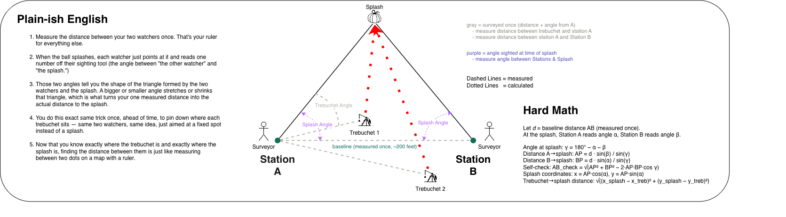

## Overview

This guide explains how to plan and set up observation stations for measuring splash distances during live trebuchet launches. It covers how baseline distance determines measurement accuracy, how to calculate the optimal baseline for your expected throwing distance, and where the point of diminishing returns lies.

## Is the Baseline the Primary Factor Under Your Control

Yes. Your assumption is spot on: **the baseline distance between Station A and Station B is the single most impactful variable you control when setting up the field.**

Here is why:

1. **The trebuchet location is fixed**: Once you set up your trebuchet and survey its distance and angle from Station A, that position is simply an offset subtraction. It shifts the reference origin, but does not alter the geometric shape of the sighting triangle.
2. **The splash location is determined by the throw**: You cannot choose where the projectile lands.
3. **The baseline length ($d$) dictates the convergence angle ($\text{angP}$)**: Because the spotters sight the splash from both ends of the baseline, the baseline length determines whether the sightlines form a well-defined triangle or two nearly parallel lines.

While sighting tool quality (such as a calibrated alidade or optical transit vs. a visual sight) also matters, baseline selection determines how severely small sighting mistakes get magnified.

## How to Determine Your Baseline from Maximum Distance

### The Golden Ratio of Triangulation

A proven rule of thumb for field triangulation is:

> **Set your baseline to between 25% and 40% (1/4 to 1/3) of your maximum expected throw distance.**

| Max Expected Throw | Recommended Baseline | Baseline Ratio | Typical Convergence at Max Throw |
| :--- | :--- | :--- | :--- |
| **200 ft** | **75 to 100 ft** | ~1:2 | 28 deg to 36 deg |
| **500 ft** | **150 to 200 ft** | ~1:3 | 17 deg to 22 deg |
| **1,000 ft** | **250 to 350 ft** | ~1:3 to 1:4 | 14 deg to 20 deg |
| **2,000 ft** | **500 to 650 ft** | ~1:3 to 1:4 | 14 deg to 18 deg |

### Why This Ratio Works

When a projectile splashes at distance $R$ out in the lake, the apex angle at the splash is:

$$\text{angP} = 180^\circ - \text{angA} - \text{angB}$$

For distant shots ($R \gg d$), this convergence angle can be approximated in radians as:

$$\text{angP} \approx \frac{d}{R}$$

As long as the apex angle stays **above 12 to 15 degrees**, small sighting errors produce modest distance errors. When the apex angle drops below **5 to 6 degrees**, distance errors explode rapidly.

## Accuracy and Error Propagation

In optical triangulation, distance error ($\Delta R$) is proportional to the square of the distance divided by the baseline:

$$\Delta R \approx \frac{R^2}{d} \cdot \Delta \theta$$

where:
- $R$ is the distance from the baseline to the splash.
- $d$ is your baseline length.
- $\Delta \theta$ is the angular error of the spotters (in radians).

### Key Takeaways from the Error Equation

1. **Distance error grows with the square of range ($R^2$)**: A 2,000 ft shot has 4 times the sensitivity to error as a 1,000 ft shot, and 16 times that of a 500 ft shot.
2. **Error is inversely proportional to baseline ($1/d$)**: Doubling your baseline cuts your distance error in half for the exact same spotter readings.

### Realistic Error Matrix

Assuming a typical field spotter error of $\pm 0.5^\circ$ at both stations, the table below shows how different baselines perform across various throw distances:

| Target Distance | Baseline = 100 ft | Baseline = 250 ft | Baseline = 500 ft | Baseline = 1,000 ft |
| :--- | :--- | :--- | :--- | :--- |
| **100 ft** | +/- 1.9 ft (1.7%) | +/- 1.1 ft (0.7%) | +/- 0.9 ft (0.3%) | +/- 0.9 ft (0.2%) |
| **200 ft** | +/- 6.9 ft (3.4%) | +/- 3.2 ft (1.4%) | +/- 2.2 ft (0.7%) | +/- 1.9 ft (0.3%) |
| **500 ft** | +/- 40.3 ft (8.0%) | +/- 17.4 ft (3.4%) | +/- 9.6 ft (1.7%) | +/- 6.1 ft (0.9%) |
| **1,000 ft** | +/- 148.8 ft (14.9%) | +/- 65.7 ft (6.5%) | +/- 34.7 ft (3.4%) | +/- 19.1 ft (1.7%) |
| **2,000 ft** | +/- 517.6 ft (25.9%) | +/- 245.5 ft (12.2%) | +/- 131.5 ft (6.5%) | +/- 69.5 ft (3.4%) |

Notice what happens at a 2,000 ft shot:
- With a 100 ft baseline, a $0.5^\circ$ sighting error produces a **517 ft error** (completely unusable).
- Expanding the baseline to 500 ft reduces that error to **131 ft** (6.5%).

## The Point of Diminishing Returns

If a longer baseline is always more accurate, why not make it 2,000 or 3,000 feet?

The point of diminishing returns usually happens when the baseline exceeds **40% to 50% of the maximum throw** (or roughly 500 to 700 feet in practice). Extending beyond that introduces severe trade-offs:

### 1. The Short-Shot Blindspot (Obtuse Triangle Problem)

If you establish an enormous baseline (e.g. 1,000 ft) to capture 2,000 ft throws, but a trebuchet misfires or throws a short 100 or 200 ft shot:
- The splash angle approaches **$140^\circ$ to $160^\circ$**.
- Spotters are looking almost directly toward each other rather than out into the lake.
- In this flattened geometry, any tiny error in angle causes massive instability in calculating whether the splash was left, right, in front of, or behind the baseline.

### 2. Shoreline Curvature and Line-of-Sight

- Real lakeshores curve, have trees, docks, reeds, and uneven topography.
- Finding 500 feet of unobstructed, straight line-of-sight between Station A and Station B is feasible on most parks or beaches.
- Finding 1,500 to 2,000 feet of uninterrupted shoreline is rarely possible without sightlines being blocked by trees or headlands.

### 3. Spotter Coordination and Splash Visibility

- Splashes in water subside within 2 to 3 seconds.
- Spotters separated by 1,000+ feet need clear radio communication and rapid confirmation that they are sighting the same splash ring rather than ripples, waterfowl, or wind chop.

### 4. Mathematical Diminishing Returns

Error follows a $1/d$ curve:
- Increasing baseline from **100 ft to 500 ft** eliminates **75%** of the distance error.
- Increasing baseline from **500 ft to 1,000 ft** only eliminates an additional **12%** of the original error, while doubling the required physical space and setup complexity.

## Field Setup Checklist

### Step 1: Establish Your Baseline

1. Pick two points on the shore (Station A on the left, Station B on the right when looking out at the lake).
2. Measure the straight-line distance $d$ between Station A and Station B using a surveyor tape, laser rangefinder, or GPS RTK.
3. Verify that Station A can see Station B, and both stations have clear views across the entire water landing zone.

### Step 2: Zero the Sighting Instruments

- **Station A**: Sight directly at Station B and set the angle gauge to $0^\circ$. Angles sweep counterclockwise (or positive into the lake) toward the splash.
- **Station B**: Sight directly back at Station A and set the angle gauge to $0^\circ$. Angles sweep counterclockwise (or positive into the lake) toward the splash.

### Step 3: Survey the Trebuchets

For each trebuchet on site:
1. Measure the straight-line distance from Station A to the pivot/release pin of the trebuchet.
2. Measure the angle from Station A to the trebuchet relative to the baseline ($0^\circ$ along line AB toward Station B, $90^\circ$ toward the lake/water). If the trebuchet is set up on land behind the baseline, enter a negative angle (down to $-180^\circ$, where $-90^\circ$ points directly behind the baseline away from the water).
3. Enter the name, distance, and angle in the **Trebuchet Setup** section of the tracker.

### Step 4: Live Event Logging

1. When a projectile launches, spotters at Station A and Station B track the flight and lock their sights on the splash center.
2. Both spotters radio in their angle: `angA` from Station A and `angB` from Station B.
3. The operator selects the firing trebuchet, enters the two angles, and logs the shot.
4. Check the **Baseline Self-Check** column in the table:
   - If the check distance is close to your measured baseline $d$ (within 2-5%), the two angle readings are geometrically consistent.
   - If the check distance deviates significantly or the system rejects the angles ($\text{angA} + \text{angB} \ge 180^\circ$), the sightlines did not converge properly and should be re-entered.
